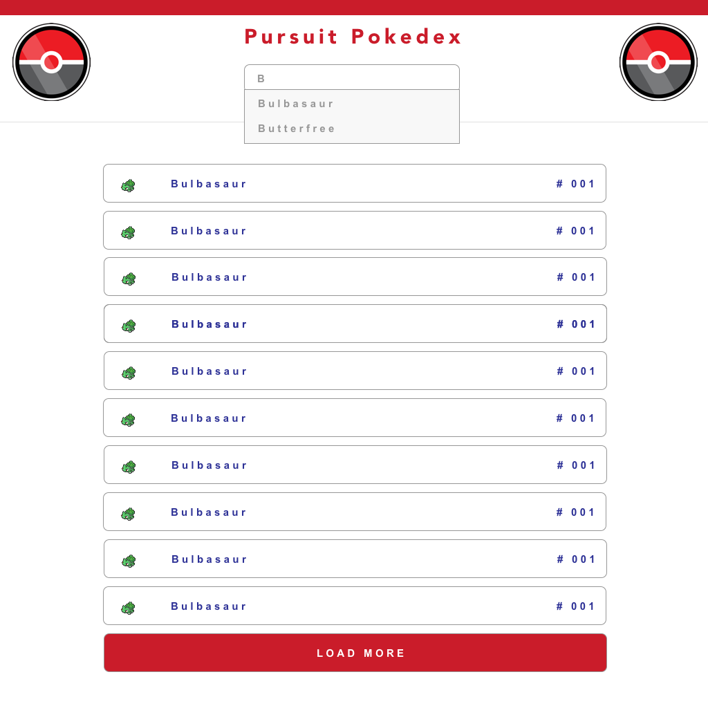
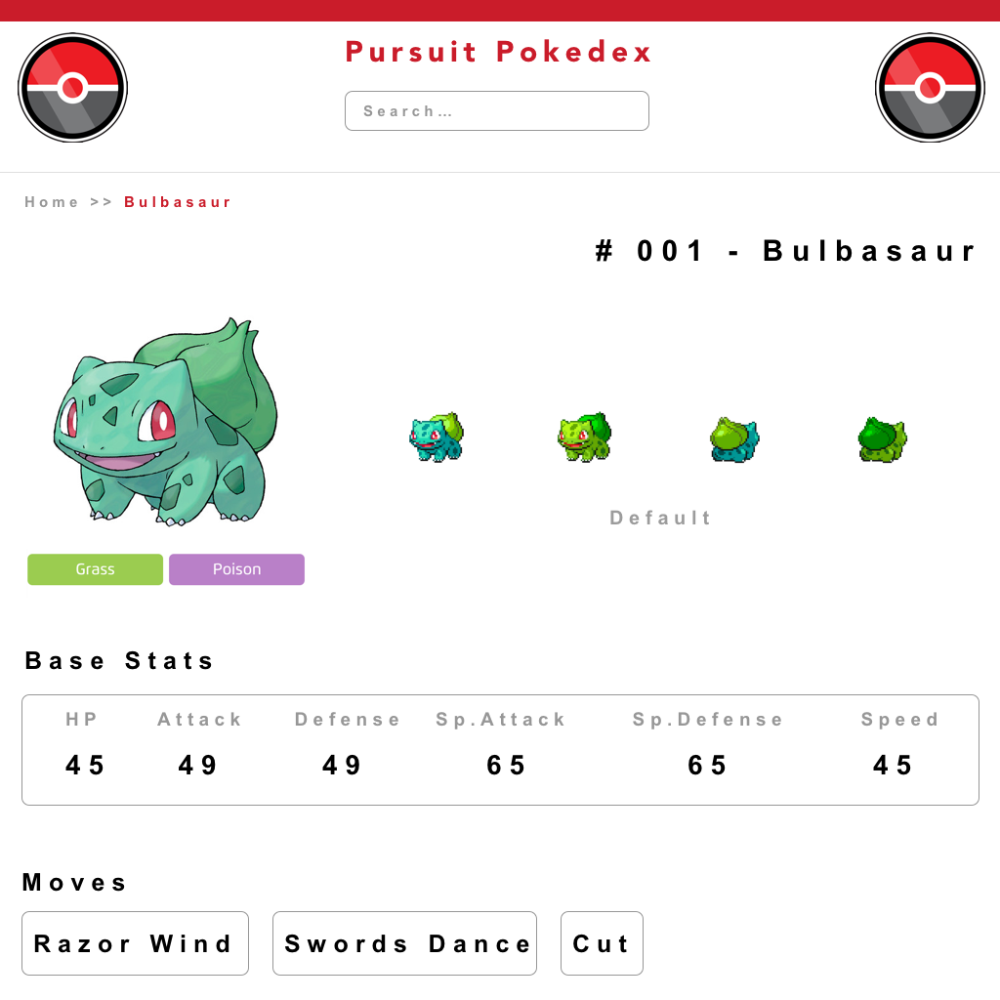
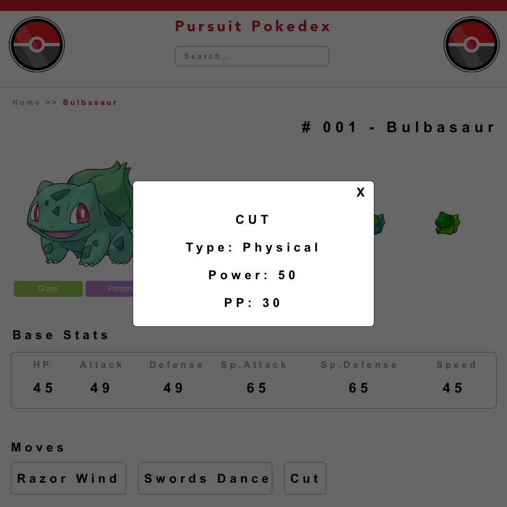

# React: Lab 2
## Pursuit Pokedex

### Task
- You will create a single page React app that mimics a Pokedex
- You will use the Public Pokemon API: `https://pokeapi.co`
- Your app may not use React Router or any external tools / libraries we haven't covered in class
- Your app must break down the app into smaller components AND associate styling CSS files for those smaller components

### Features

#### Home


- Header area with the Title, search bar etc
- Home will display master list of Pokemon:
  - Small Image
  - Name
  - Number represented like: `# 001`
- Hovering over each pokemon should do a highlight effect
- Clicking on the Pokemon should take you to that Pokemon's page
- You can get each image by:
  - `https://img.pokemondb.net/sprites/sun-moon/icon/{pokemon-name}.png`
  - EG: `https://img.pokemondb.net/sprites/sun-moon/icon/bulbasaur.png`
- You will generate this list of Pokemon using a very important concept called **Pagination**
  - API: `https://pokeapi.co/api/v2/pokemon/?offset=0&limit=20`
  - You may **ONLY** fetch 20 Pokemon at a time
  - You may **NOT** fetch all 800+ Pokemon at once
  - To load more, there must be a `LOAD MORE` button. Once the user clicks it, it should load the NEXT SEQUENCE of Pokemon **BELOW**. Adding to the Master List.
  - If you want to go above and beyond but not needed for this lab: 
    - You may implement infinite scroll loading like in Instagram
    - You may need the following information:  
    - ```javascript
      onScroll Event
      window.innerHeight 
      window.scrollY
      document.body.scrollTop
      ```

#### Home - Search Active



- As a User types in the search bar, you will give suggestions below the input field.
- The suggestions will use the `pkmn-list.js` data. Which you will store locally. Please do not send an API request for this information.
- This is very similiar to the Spotify Playlist Search Lab
- Hovering over each name of the Pokemon should have a hover effect
- Clicking on the Pokemon name should take you to that Pokemon's page
- This search functionality needs to work on any page. **HOME** and **PROFILE**

#### Selected Pokemon's Profile Page



- API: `https://pokeapi.co/api/v2/pokemon/{pokemon-name}`
  - Eg: `https://pokeapi.co/api/v2/pokemon/bulbasaur`
- That API will return all the data that you need on this page
- You will need to create a `Type Component` similar to the `Tag Component` in our Trello Board App. 
  - This component will always have a particular `backgroundColor` for the particular type.
  - You will be doing something like the following:
    - `<Type name='Grass' /> <Type name='Poison' />`
  - We will leave you to find the colors for all the types LOL
  - There are a total of 18 types
    - `https://bulbapedia.bulbagarden.net/wiki/Type`
- Clicking on the individual moves will open up the Active Move component

#### Active Move on Pokemon's Profile



- API: `https://pokeapi.co/api/v2/move/{move-name}/`
  - Eg: `https://pokeapi.co/api/v2/move/razor-wind/`
- Clicking on an individual move should open up this box / modal centered on the page with a close button.
- This box will display the following data from the API:
  - NAME
  - Type
  - Power
  - PP
- This mode should darken the rest of the page
- Clicking the close should return User to the regular profile